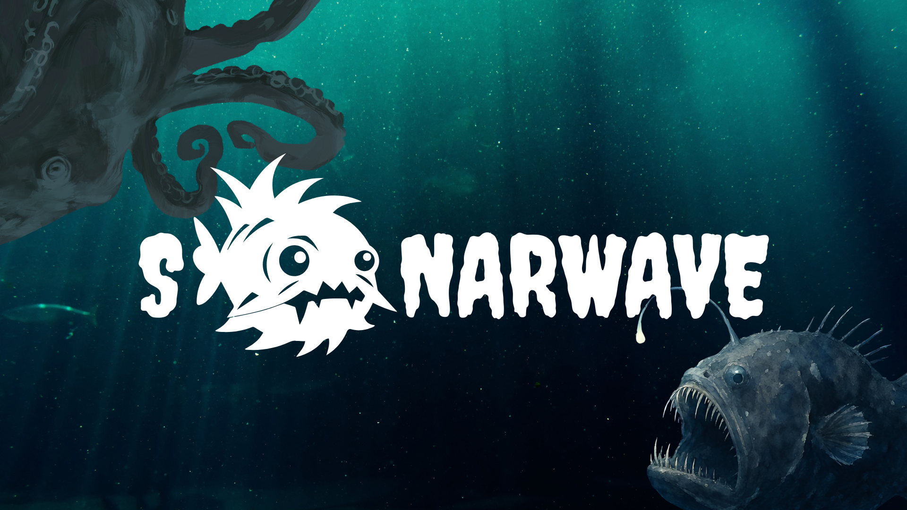
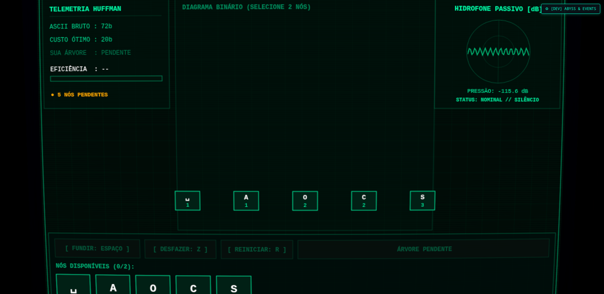
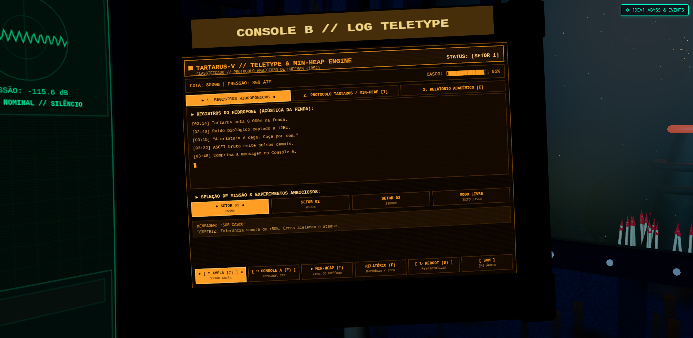
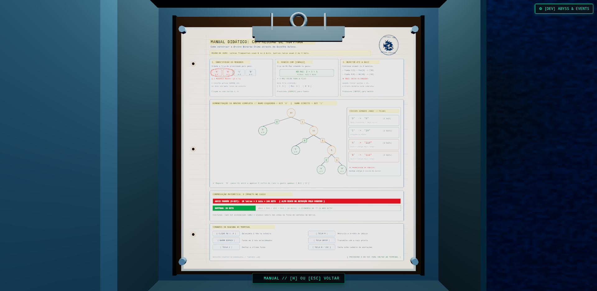
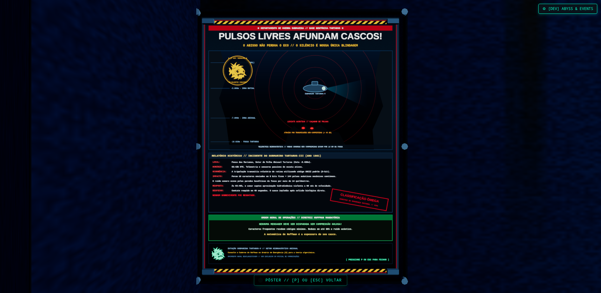
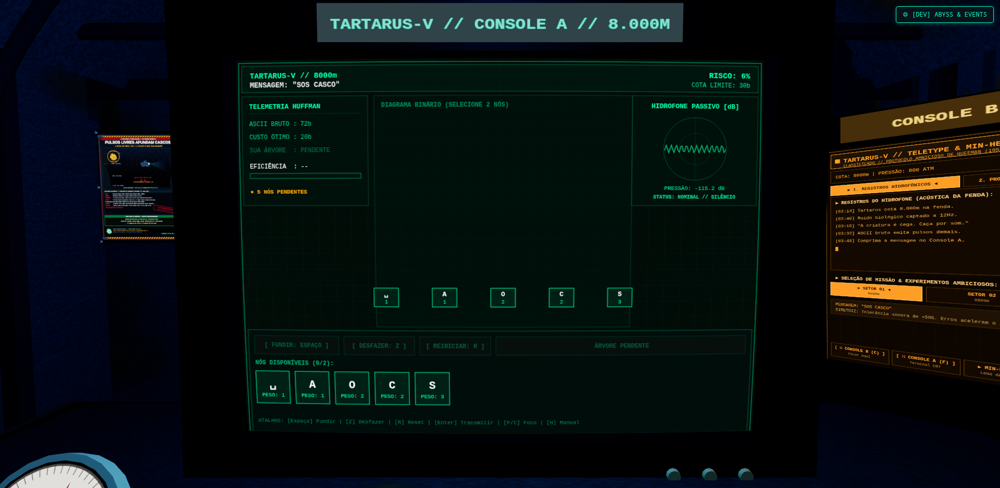

<p align="center">
  
</p>

<p align="center">
  <a href="https://projeto-de-algoritmos-2026.github.io/G6_Greed_PA-26.2/" target="_blank">
    
  </a>
  &nbsp;&nbsp;
  <a href="https://youtu.be/66oQ009uz70" target="_blank">
    
  </a>
</p>

# SONARWAVE - Grupo 6

Número da Lista: 2<br>
Conteúdo da Disciplina: Greed<br>

## Alunos

| Matrícula | Aluno |
| :---: | :--- |
| 24/1011027 | Eduardo Lôbo Moreira |
| 24/1041302 | Hugo Freitas Silva |

## Sobre

O **SONARWAVE** é um jogo de terror analógico e simulação submarina em 3D desenvolvido para a disciplina de Projeto de Algoritmos da Universidade de Brasília (UnB). O projeto explora a aplicação prática, matemática e didática de **Algoritmos Ambiciosos (Greed)** através da **Codificação de Huffman** em um cenário claustrofóbico de sobrevivência na Fossa das Marianas, a 8.000 metros de profundidade.

Você assume o controle do posto de comunicação a bordo do submarino de pesquisa naval **Tartarus-V**, preso no fundo oceânico sob uma pressão externa catastrófica superior a 800 atmosferas. Nas profundezas escuras da fenda habita um **Leviatã Abissal cego** que caça exclusivamente por ecolocalização e vibrações acústicas na água. Transmitir relatórios em código ASCII padrão (8 bits por caractere) dispara rajadas contínuas de alta energia sonora mecânica que ecoam pelas falésias basálticas da fossa, atraindo a criatura e causando a implosão instantânea do casco. A única forma de resgate é aplicar a estratégia gulosa de Huffman para comprimir as mensagens de socorro ao menor número possível de bits antes de emitir qualquer sinal sonoro.

### Como funciona

- **Modelagem do Algoritmo de Huffman (Greedy Choice Property):** Toda a lógica do algoritmo guloso está implementada no arquivo [`src/lib/engine/huffman.ts`](https://github.com/projeto-de-algoritmos-2026/G6_Greed_PA-26.2/blob/main/src/lib/engine/huffman.ts). A cada passo, o algoritmo analisa a frequência acumulada dos caracteres da mensagem $C$ e seleciona estritamente os dois nós de menor peso para fundi-los em um novo nó pai. A propriedade da escolha gulosa garante matematicamente que existe uma árvore de prefixos ótima em que os dois caracteres menos frequentes são folhas irmãs na profundidade máxima da árvore.
- **Fila de Prioridade / Min-Heap:** A estrutura fundamental de dados que viabiliza a seleção ambiciosa é uma fila de prioridade mínima com operações de inserção e extração em tempo $O(\log n)$. A cada iteração gulosa, os dois nós mais leves são extraídos do Min-Heap, e um novo nó pai cujo peso é a soma exata das frequências dos filhos é reinserido na fila. O processo repete-se $n - 1$ vezes até restar um único nó: a raiz da árvore binária ótima de Huffman, atingindo complexidade de tempo total de $O(n \log n)$.
- **Subestrutura Ótima:** Ao fundir dois símbolos $x$ e $y$ em um símbolo agregado $z$ com peso $f(z) = f(x) + f(y)$, o problema de construir uma árvore ótima para o alfabeto $C$ de tamanho $n$ é reduzido a encontrar a árvore ótima para o alfabeto $C' = (C \setminus \{x, y\}) \cup \{z\}$ de tamanho $n - 1$. O custo total ponderado em bits obedece rigorosamente à relação:
  $$B(T) = B(T') + f(x) + f(y)$$
- **Console A (CRT Terminal 3D e Árvore Dinâmica):** O jogador opera um terminal militar de tubo de raios catódicos (CRT) dos anos 80, visualizando nós em 3D, conexões a laser e rotulagem de bits (`0` no ramo esquerdo, `1` no ramo direito). O jogador seleciona os nós na esteira retrô e executa as fusões com a tecla `Espaço`, acompanhando a árvore crescer dinamicamente em tempo real até atingir a raiz única.
- **Console B (Telemetria, Teletype e Lema de Huffman):** Um segundo monitor de fósforo âmbar exibe os registros hidroacústicos do submarino, a visualização esquemática da Min-Heap em tempo real, a demonstração formal do Lema de Huffman e um gerador de relatórios acadêmicos com métricas de compressão e eficiência calculadas instantaneamente.
- **Caderno Didático e Pôster no Cenário da Cabine:** Integrados ao ambiente tridimensional da cabine, o jogador pode abrir o armário de emergência (`H`) para consultar um caderno em papel pautado com desenhos explicativos e passo a passo didático de Huffman, ou examinar o pôster naval na antepara (`P`) detalhando a doutrina acústica militar da Guerra Fria e a lore do incidente Tartarus-III.
- **Mecânicas de Tensão e Sobrevivência:** Cada bit transmitido gera um pulso de sonar audível com atraso exponencial. Erros na árvore geram excesso de bits, elevando os decibéis emitidos no hidrofone acima da cota segura (40 dB) e acelerando a investida fatal do Leviatã.

## Screenshots

### Tela Inicial


### Partida em Andamento



### Telemetria e Fila de Prioridade (Min-Heap)



### Caderno Didático de Huffman



### Pôster Doutrinário e Lore Tartarus



### Visão Geral da Cabine do Submarino



## Fases e Mecânicas de Jogo

A cada carregamento, a fase sorteia uma mensagem do seu conjunto, então a árvore
muda entre tentativas.

| Setor | Profundidade | Margem | Novidade |
|---|---|---|---|
| 01 · Abisso Inicial | 8.000m · 800 ATM | 50% | Mensagens curtas com símbolos repetidos |
| 02 · Zona Hadal | 9.500m · 950 ATM | 35% | Empates de frequência, silêncio e interrupções |
| 03 · Fossa das Marianas | 11.000m · 1.100 ATM | 25% | Frequências corrompidas (`??`) |
| 04 · Fenda Tartarus | 12.400m · 1.240 ATM | 18% | Alfabeto maior: números e pontuação |
| 05 · Núcleo Abissal | 13.900m · 1.390 ATM | 12% | Margem mínima e imitações frequentes |

* **Modo Transmissão Livre:** permite digitar qualquer mensagem arbitrária, gerando tabelas de frequência em tempo real.

### Cota Segura e Ruído Acústico

Durante a transmissão, a quantidade de ruído acumulado é comparada à cota segura
da fase. A cota segura é calculada por `ceil(custo ótimo × (1 + margem da fase))`.
Árvores mais longas transmitem mais bits e podem provocar o colapso do
casco mesmo quando a transmissão não chega a 100% de proximidade acústica. Se o custo
da árvore montada ultrapassar esse limite, a transmissão termina em colapso e exige uma nova tentativa.

### Mecânicas de Tensão e Sobrevivência

* **Frequências corrompidas:** alguns pesos chegam como `??` (e também os dos nós que os contêm). Conte os símbolos na mensagem para deduzir o valor.
* **Árvores ótimas alternativas:** com empates, a árvore do jogador pode ter formato diferente da referência e o mesmo custo; a tela de debriefing explica quando isso acontece.
* **Vazamento acelerado:** cada fusão que não junta os dois menores pesos aumenta o multiplicador de vazamento da fase.
* **A criatura reage aos erros:** o primeiro erro guloso faz a entidade bater no casco, o segundo a faz aparecer na escotilha e, a partir do terceiro, ela ataca.
* **Silêncio obrigatório:** quando o hidrofone detecta contato próximo, qualquer comando durante a contagem gera ruído.
* **Transmissão interrompida:** um impacto suspende o envio. `[Enter]` continua com ruído dobrado nos próximos bits; `[S]` segura o sinal por alguns segundos ao custo de dano permanente ao casco.
* **Dano persistente:** o estresse acústico de cada fase reduz a integridade do casco, acelera o vazamento nas fases seguintes e deixa rachaduras na escotilha. Recomeçar do Setor 01 restaura o casco.

### Decodificação e Imitações da Entidade

Após a transmissão, a superfície responde com um fluxo de bits e a árvore usada
para codificá-lo. Digite cada caractere encontrado percorrendo a árvore (0 =
esquerda, 1 = direita) ou clique na folha correspondente; erros geram ruído.

Ao final, julgue a resposta com `[A]` (autêntica) ou `[I]` (imitação). A
superfície sempre usa a árvore gulosa ótima; a entidade imita o sinal com uma
árvore em que uma folha frequente foi trocada com uma rara e profunda. Confiar
em uma imitação abre a escotilha.

### Sonificação e Áudio Procedural

Bits `1` e `0` têm timbres diferentes e um sinal curto marca o fim de cada
símbolo, tanto na transmissão quanto na decodificação. A tela de transmissão
separa os grupos de bits e mostra o código do símbolo em envio. Toda a paisagem sonora é gerada 100% em tempo real via Web Audio API.

## Instalação

**Linguagem:** TypeScript<br>
**Framework:** Svelte 5 (Runes)<br>
**Motor Gráfico 3D:** Three.js com Shaders GLSL Customizados<br>
**Síntese Sonora:** Web Audio API Procedural<br>

### Pré-requisitos

- **Node.js** (versão 18 ou superior)
- **npm**

### Comandos de Execução

1. Clone o repositório:

```bash
git clone https://github.com/projeto-de-algoritmos-2026/G6_Greed_PA-26.2.git
cd G6_Greed_PA-26.2
```

2. Instale as dependências do projeto:

```bash
npm install
```

3. Inicie o servidor de desenvolvimento:

```bash
npm run dev
```

O jogo estará disponível no navegador em: `http://localhost:5173/`

## Uso

1. Na tela inicial do terminal, pressione qualquer tecla ou clique para pular a sequência de boot analógica do Tartarus-OS.
2. Controles do operador:
   - **`1`, `2`, `3`, `4`** ou **Clique do Mouse**: Selecionar dois nós na esteira inferior de caracteres pendentes.
   - **`Espaço`**: Executar a **Fusão Ambiciosa** entre os 2 nós selecionados (cria o nó pai com peso somado).
   - **`Z`**: Desfazer a última fusão de nós (aplica penalidade de ruído no sonar).
   - **`R`**: Reiniciar a árvore binária do nível atual.
   - **`Enter`**: Disparar transmissão acústica de emergência (disponível quando a árvore tiver apenas 1 raiz).
   - **`F` / `C`**: Alternar o foco da câmera para o Console A (CRT Verde) ou Console B (Teletype Âmbar).
   - **`T`**: Abrir a aba de Min-Heap e Lema de Huffman no Console B.
   - **`H`**: Abrir o armário técnico de emergência e inspecionar o **Caderno de Huffman** em papel pautado.
   - **`P`**: Inspecionar o **Pôster Doutrinário** militar de segurança naval na parede do submarino.
   - **`W`**: Olhar pela escotilha de vidro reforçado para a fenda abissal escura.
   - **`Esc`**: Retornar à visão panorâmica ampla da cabine.
   - **`M`**: Silenciar / ativar os sintetizadores de áudio procedural.
   - **`B`**: Reiniciar os computadores de bordo (Sequência de Reboot).
   - **`E`**: Exportar relatório acadêmico de eficiência e complexidade em Markdown / JSON.
3. Para vencer a missão:
   - Identifique as menores frequências entre os nós disponíveis.
   - Combine os pares iterativamente usando a escolha gulosa até unificar toda a mensagem em uma única árvore.
   - Mantenha o custo total de bits dentro da cota de segurança da profundidade para evitar a detecção do monstro.
   - Pressione `Enter` para transmitir e avance pelas cotas de 8.000m, 9.500m e 11.000m até o Modo Livre.

## Outros

### Link do Vídeo de Apresentação

- [https://youtu.be/66oQ009uz70](https://youtu.be/66oQ009uz70)

### Comandos Adicionais

- Verificação de tipos (TypeScript + Svelte):

```bash
npm run check
```

- Geração do bundle de produção:

```bash
npm run build
```

- Deploy no GitHub Pages:

```bash
npm run deploy
```

### Tecnologias e Recursos

- **Renderização 3D Imersiva:** Three.js com modelos procedurais da cabine, monitores de fósforo curvos, iluminação pontual dinâmica, reflexos e shaders pós-processamento GLSL (scanlines, distorção esférica de tubo CRT, aberração cromática e ruído analógico).
- **Design de Som Procedural:** Síntese de áudio 100% em tempo real com a Web Audio API (sem arquivos de áudio externos), incluindo ruído marinho browniano filtrado, batimento binaural sub-grave, pings de sonar ressonantes, estalos mecânicos de relé solenoide e rangidos dinâmicos do casco sob estresse.
- **Reatividade e Estado:** Desenvolvido em Svelte 5 com Runes (`$state`, `$derived`, `$props`), garantindo sincronização fluida entre as ações do jogador, a árvore de Huffman e a textura renderizada nos monitores 3D.
- **Motor Algorítmico Guloso:** Implementação pura de Huffman em [`src/lib/engine/huffman.ts`](https://github.com/projeto-de-algoritmos-2026/G6_Greed_PA-26.2/blob/main/src/lib/engine/huffman.ts), com cálculo exato de entropia, códigos binários de prefixo livre, eficiência em relação ao ótimo e comparação direta com código ASCII de 8 bits.

## Créditos

- **Desenvolvedores:**
  - Eduardo Lôbo Moreira (24/1011027)
  - Hugo Freitas Silva (24/1041302)
- **Disciplina:** Projeto de Algoritmos (PA 26.2) — Módulo de Greed (Universidade de Brasília - UnB)
- **Arte Visual e Gráficos:**
  - Cabine 3D, geometria, painéis e shaders desenvolvidos pelos autores com Three.js.
  - Logo e artes do terminal desenhadas pela equipe.
- **Áudio e Efeitos Sonoros:**
  - Sintetizador de áudio procedural desenvolvido exclusivamente em código TypeScript utilizando Web Audio API (Nodes de Oscilador, BiquadFilter, Convolver e WaveShaper).
